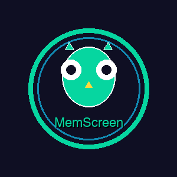

<div align="center">

  <!-- Main Logo -->
  

  # 🦉 MemScreen

  ### **AI-Powered Visual Memory. 100% Private.**

  <br/>

  [](https://www.producthunt.com/products/memscreen)
  [](https://www.shipit.buzz/products/memscreen)
  [](https://www.nxgntools.com/tools/memscreen)
  [](https://github.com/smileformylove/MemScreen)
  [](https://github.com/smileformylove/MemScreen)
  [](https://github.com/smileformylove/MemScreen/stargazers)
  [](LICENSE)
  [](https://www.python.org/downloads/)
  [](https://ollama.com)
  [](https://docs.vllm.ai/)
  [](https://github.com/smileformylove/MemScreen/releases/tag/v0.5.0)

  **100% Local • 100% Private • AI-Powered Visual Memory System**

  [⚡ Quick Start](#-quick-start) • [✨ Features](#-features) • [🎬 Demo](#interface-preview) • [📖 Documentation](#-documentation)

</div>

---

## ✨ What is MemScreen?

<div align="center">

  

</div>

**MemScreen** is your personal AI-powered visual memory system that captures, understands, and remembers everything on your screen — **100% locally, 100% privately**.

### 🚀 The Problem

> Ever forgotten something you saw on your screen?
> - "What was that article about Python decorators I read yesterday?"
> - "Where did I see that UI mockup with the dark blue button?"
> - "What was that function I wrote last Tuesday?"

### 💡 The Solution

**MemScreen** gives you a **photographic memory for your digital life**:
- 📸 **Record** your screen continuously or on-demand
- 🤖 **AI-powered understanding** with local vision models
- 🔍 **Instant semantic search** across all your recordings
- 💬 **Natural language queries** — just ask like you would a human
- 🔒 **Zero privacy concerns** — everything runs locally on your machine

<div align="center">

  **🎉 Featured on Product Hunt, ShipIt & NXGenTools!**

  **[🚀 Product Hunt](https://www.producthunt.com/products/memscreen)** — The best place to discover and launch new products

  **[🚢 ShipIt](https://www.shipit.buzz/products/memscreen)** — The launchpad for makers to reach early adopters

  **[🛠️ NXGenTools](https://www.nxgntools.com/tools/memscreen)** — Discover the best AI tools and resources

  **🎉 v0.5.0 — Enhanced Custom Region Recording & Clean UI!**

  - 🎯 **Custom Region Selection** — Select any area of your screen to record
  - 📐 **Visual Crosshair Guides** — Precise region selection with guide lines
  - 🔄 **Re-selectable** — Change your selection as many times as needed
  - ✨ **Sleek Interface** — Clean, focused user experience with modern sidebar
  - 🧹 **Code Cleanup** — Removed unused files for better maintainability

  [View Changelog](https://github.com/smileformylove/MemScreen/compare/v0.4.0...v0.5.0)

</div>

---

## ⚡ Quick Start

<div align="center">

  

  **Get Started in 3 Minutes**

</div>

Get up and running in **3 minutes** — **no API keys, no cloud, no signup!**

### 🐳 Option 1: Docker (Recommended)

**Easiest way** - No dependencies to install!

```bash
# 1️⃣ Clone the repository
git clone https://github.com/smileformylove/MemScreen.git && cd MemScreen

# 2️⃣ One-command start
docker-compose up -d

# 3️⃣ Check logs
docker-compose logs -f memscreen
```

✅ **Pros:** Auto-installs everything, isolated environment, easy cleanup
📚 **See:** [Docker Guide](docs/DOCKER.md) for advanced options

---

### 💻 Option 2: Local Installation

```bash
# 1️⃣ Clone the repository
git clone https://github.com/smileformylove/MemScreen.git && cd MemScreen

# 2️⃣ Install Ollama (local AI runtime)
brew install ollama        # macOS (visit ollama.com for Linux/Windows)

# 3️⃣ Download AI Models (one-time, ~3GB)
ollama pull qwen2.5vl:3b          # Vision model (~2GB)
ollama pull mxbai-embed-large     # Text embeddings (~470MB)

# 4️⃣ Install Python dependencies
pip install -r requirements.txt

# 5️⃣ Launch MemScreen 🚀
python start.py
```

**That's it!** Start recording and searching your screen memory immediately.

> **💡 Pro Tip:** Once models are downloaded, MemScreen works **completely offline**. No internet needed.

---

## ✨ Features

<div align="center">

  

  **Comprehensive Screen Memory System**

</div>

### 🎯 Screen Recording

- **🖥️ Full Screen Recording** — Capture everything on your screen
- **📐 Custom Region Recording** — Select specific areas to record
  - Drag-to-select with visual crosshair guides
  - Re-selectable until you start recording
  - Perfect for recording specific windows or areas
- **⏱️ Flexible Intervals** — Set capture frequency (0.5s - 5s)
- **👁️ Live Preview** — See exactly what's being captured

### 🤖 AI-Powered Understanding

- **🧠 Vision Intelligence** — Local MLLM (qwen2.5vl) understands your screen visually
- **📝 OCR Text Extraction** — Extract text from any screen content
- **🎨 Scene Recognition** — Identifies applications, activities, and UI elements
- **🔍 Semantic Search** — Find anything by meaning, not just keywords

### 🎯 Intelligent Agent (New!)

- **⚡ Auto Input Classification** — Automatically recognizes 15 input types (questions, tasks, code, procedures, etc.)
- **🎯 Query Intent Recognition** — Identifies 7 query intents for intelligent routing
- **🤖 Smart Dispatch System** — Automatically routes to the best handler without manual coding
- **🚀 3-5x Faster** — Category-based routing dramatically speeds up responses
- **💰 70% Fewer Tokens** — Targeted context retrieval reduces API usage

### 📊 Dynamic Memory System

- **🗂️ Categorized Storage** — 15 memory categories for intelligent organization
- **🔍 Smart Search** — Search only relevant categories for faster results
- **🎯 Context Optimization** — Automatically retrieves the most relevant context
- **🌏 Multi-Language Support** — Chinese and English input classification
- **📈 Adaptive Learning** — Tracks usage patterns to optimize performance

### 💬 Natural Language Chat

- **❓ Ask Questions** — "What was that article about Python I read yesterday?"
- **📊 Summarize** — "Summarize all documentation I viewed this week"
- **🔎 Search** — "Find the UI mockup with the dark blue button"
- **💡 Smart Responses** — AI uses your screen memory to answer accurately

### 🔒 Privacy First

- **✅ 100% Local** — All AI processing happens on your machine
- **🚫 No Cloud** — No data sent to external servers
- **🔐 No API Keys** — Works out of the box
- **📖 Open Source** — Verify the code yourself

### 📊 Memory Sources

MemScreen builds comprehensive memory through **three integrated sources**:

1. **📸 Screen Recordings** — Primary source with OCR and scene understanding
2. **⌨️ Process Mining** — Keyboard/mouse tracking and activity patterns
3. **💬 Chat History** — Your conversations and queries

---

## 🎬 Interface Preview

<div align="center">

  

  **Your AI-Powered Visual Memory**

</div>

### 🔴 Recording Tab

Choose your recording mode and start capturing:

- **🖥️ Full Screen** — Record everything on your display
- **📐 Custom Region** — Select specific areas to record
  - Drag to select with visual crosshair guides
  - Press **ESC** to cancel, or reselect as needed
  - Click **"Start Recording"** when ready
- **👁️ Live Preview** — See what's being captured in real-time
- **📈 Real-time Stats** — Frame count and elapsed time

### 💬 AI Chat Tab

Ask questions and get intelligent answers:

- **💭 Natural Questions** — Just type like you're asking a person
- **🔍 Memory Search** — AI searches all your recordings automatically
- **🎯 Context-Aware** — Uses OCR and scene understanding for accuracy
- **📊 Rich Responses** — Detailed answers with specific references

### 🎬 Videos Tab

Browse your recordings with intuitive timeline navigation:

- **📅 Visual Timeline** — See all your recordings at a glance
- **🎯 Video Markers** — Purple dots show when recordings were made
- **▶️ Playback Controls** — Play, pause, seek through videos
- **📊 Frame Navigation** — Jump to any moment instantly

---

## 📦 Installation

<div align="center">

  

  **Get Started in Minutes**

</div>

### 🍎 macOS (Recommended)

**Prerequisites:**
- macOS 11+ (Big Sur or later)
- Python 3.8 or higher
- 5GB free disk space

```bash
# Step 1: Install Ollama
brew install ollama

# Step 2: Start Ollama service
ollama serve
# Keep this terminal open, or press Ctrl+Z and type 'bg'

# Step 3: Pull AI Models (one-time)
ollama pull qwen2.5vl:3b          # Vision model (~2GB)
ollama pull mxbai-embed-large     # Embeddings (~470MB)

# Step 4: Install MemScreen
git clone https://github.com/smileformylove/MemScreen.git
cd MemScreen
pip install -r requirements.txt

# Step 5: Launch
python start.py
```

### 🐧 Linux / 🪟 Windows

```bash
# Install Ollama from https://ollama.com/download
# Pull AI models
ollama pull qwen2.5vl:3b
ollama pull mxbai-embed-large

# Install MemScreen
git clone https://github.com/smileformylove/MemScreen.git
cd MemScreen
pip install -r requirements.txt

# Launch
python start.py
```

---

## 📖 Documentation

For detailed documentation, see:
- [Docker Deployment](docs/DOCKER.md) — Containerized deployment guide
- [vLLM Backend](docs/VLLM_BACKEND.md) — High-performance inference backend setup
- [Step-3.5-Flash Model](docs/STEP35FLASH.md) — Advanced reasoning model integration
- [Architecture Overview](docs/ARCHITECTURE.md) — System design and components
- [Intelligent Agent System](docs/INTELLIGENT_AGENT.md) — Auto-classification and smart dispatch
- [Dynamic Memory System](docs/DYNAMIC_MEMORY.md) — Categorized memory and intelligent search
- [Testing Guide](docs/TESTING_GUIDE.md) — How to test the system
- [Quick Start Guide](docs/QUICK_START_GUIDE.py) — Interactive setup tutorial
- [Logo & Brand Guidelines](docs/LOGO_GUIDELINES.md) — Logo usage and branding

---

## 🆚 Why MemScreen?

<div align="center">

  

  **See Why Users Choose MemScreen**

</div>

| Feature | MemScreen | OBS | Loom | CleanShot X |
|---------|-----------|-----|------|-------------|
| **Privacy** | ✅ **100% Local** | ✅ Local | ❌ Cloud | ✅ Local |
| **AI Understanding** | ✅ **Local MLLM** | ❌ No | ✅ Cloud AI | ❌ OCR only |
| **Semantic Search** | ✅ **Yes** | ❌ No | ❌ No | ❌ No |
| **Natural Language** | ✅ **Yes** | ❌ No | ❌ No | ❌ No |
| **Custom Region** | ✅ **Yes** | ✅ Yes | ❌ No | ✅ Yes |
| **Process Mining** | ✅ **Yes** | ❌ No | ❌ No | ❌ No |
| **Open Source** | ✅ **MIT** | ✅ GPL | ❌ No | ❌ No |
| **Cost** | **Free Forever** | Free | $15-30/mo | Paid |

### 🔒 Privacy Guarantee

```
❌ Other AI Tools:
   Screenshot → Upload to Cloud → Process → Return Result
   ⚠️ Your data on their servers ⚠️

✅ MemScreen:
   Screenshot → Process Locally → Result
   🔒 Your data stays with you 🔒
```

---

## 🛠️ Tech Stack

<div align="center">

  

  **Built with Privacy-First Technologies**

</div>

| Component | Technology | Privacy |
|-----------|------------|----------|
| **GUI Framework** | Kivy | ✅ Local |
| **Screen Capture** | PIL ImageGrab | ✅ Local |
| **Video Processing** | OpenCV | ✅ Local |
| **Databases** | SQLite + ChromaDB | ✅ Local |
| **AI Inference Backends** | Ollama / vLLM | ✅ **100% Local** |
| **Vision Models** | qwen2.5vl:3b / Qwen2-VL | ✅ **100% Local** |
| **Advanced Reasoning** | Step-3.5-Flash (optional) | ✅ **100% Local** |
| **Language** | Python 3.8+ | ✅ Local |

---

## 🧠 AI Inference Backends

<div align="center">

  

  **Flexible Inference Options**

</div>

MemScreen supports **multiple local AI inference backends** for different use cases:

### 🦙 Ollama (Default)

**Best for:** Development, local testing, users without dedicated GPUs

- ✅ **Easy setup** — One-command installation
- ✅ **Mac-friendly** — Runs on macOS without GPU
- ✅ **Low resource usage** — ~4GB RAM
- ✅ **Good models** — qwen2.5vl:3b (vision), mxbai-embed-large (embeddings)

**Setup:**
```bash
# Install Ollama
brew install ollama  # macOS

# Pull models
ollama pull qwen2.5vl:3b
ollama pull mxbai-embed-large

# Start MemScreen
python start.py
```

### ⚡ vLLM (Production)

**Best for:** Production deployments, high throughput, GPU acceleration

- ✅ **High performance** — PagedAttention for efficient memory management
- ✅ **OpenAI-compatible API** — Drop-in replacement for cloud APIs
- ✅ **GPU optimized** — Tensor parallelism for multi-GPU setups
- ✅ **Production-ready** — Used by enterprises for inference at scale

**Models:**
- **LLM:** Qwen/Qwen2.5-7B-Instruct (default)
- **Vision:** Qwen/Qwen2-VL-7B-Instruct
- **Embeddings:** intfloat/e5-mistral-7b-instruct

**Setup:**
```bash
# Install vLLM (optional dependency)
pip install 'memscreen[vllm]'

# Start vLLM server with Docker
docker-compose -f docker-compose.vllm.yml up -d

# Configure MemScreen to use vLLM
export MEMSCREEN_LLM_BACKEND=vllm
export MEMSCREEN_VLLM_URL=http://localhost:8000

# Start MemScreen
python start.py
```

**Hardware Requirements:**
- GPU: NVIDIA GPU with 12GB+ VRAM (for 7B models)
- CPU: Modern multi-core processor
- RAM: 16GB+ recommended

### 🚀 Step-3.5-Flash (Advanced Reasoning)

**Best for:** Complex reasoning tasks, mathematical problem solving, multi-step logic

- ✅ **196B parameters** — Only 11B active (sparse MoE)
- ✅ **Multi-token prediction** — Faster inference
- ✅ **Built-in reasoning** — Optimized for complex logic
- ✅ **Tool calling** — Native function execution support

**Setup:**
```bash
# Requires 4x H200/H20/B200 GPUs (~400GB VRAM for FP16)

# Start Step-3.5-Flash server
docker-compose -f docker-compose.step35flash.yml up -d

# Configure MemScreen
export MEMSCREEN_LLM_BACKEND=vllm
export MEMSCREEN_VLLM_URL=http://localhost:8001
export MEMSCREEN_VLLM_LLM_MODEL=stepfun-ai/Step-3.5-Flash

# Start MemScreen
python start.py
```

**Hardware Requirements:**
- GPU: 4x NVIDIA H200/H20/B200 (recommended)
- VRAM: ~400GB for FP16, ~200GB for FP8
- Alternative: Use FP8 version with 2x GPUs

See [Step-3.5-Flash Documentation](docs/STEP35FLASH.md) for details.

### 🔄 Switching Backends

Easily switch between backends using environment variables:

```bash
# Use Ollama (default)
export MEMSCREEN_LLM_BACKEND=ollama

# Use vLLM with standard models
export MEMSCREEN_LLM_BACKEND=vllm
export MEMSCREEN_VLLM_URL=http://localhost:8000

# Use vLLM with Step-3.5-Flash
export MEMSCREEN_LLM_BACKEND=vllm
export MEMSCREEN_VLLM_URL=http://localhost:8001
export MEMSCREEN_VLLM_LLM_MODEL=stepfun-ai/Step-3.5-Flash
```

### 📊 Backend Comparison

| Feature | Ollama | vLLM (Standard) | vLLM (Step-3.5-Flash) |
|---------|--------|-----------------|----------------------|
| **Setup Difficulty** | ⭐ Easy | ⭐⭐ Medium | ⭐⭐⭐ Hard |
| **Hardware Requirements** | CPU/GPU | GPU (12GB+) | 4x GPU (200GB+) |
| **Performance** | Good | Excellent | Outstanding |
| **Model Size** | 3B | 7B | 196B (11B active) |
| **Reasoning** | Basic | Good | Advanced |
| **Best For** | Development | Production | Complex Tasks |

---

## 📝 What's New

### ✨ v0.5.0 — Dynamic Memory System & Intelligent Agent (February 2026)

**🤖 Intelligent Agent System:**
- **Auto Input Classification** — Automatically recognizes 15 input types (questions, tasks, code, procedures, etc.)
- **Query Intent Recognition** — Identifies 7 query intents for intelligent routing
- **Smart Dispatch System** — Automatically routes to the best handler without manual if-else
- **3-5x Performance Boost** — Category-based routing dramatically speeds up responses
- **70% Token Reduction** — Targeted context retrieval reduces API usage

**📊 Dynamic Memory System:**
- **15 Memory Categories** — Intelligent organization (question, task, fact, code, procedure, etc.)
- **7 Query Intents** — retrieve_fact, find_procedure, search_conversation, locate_code, etc.
- **Smart Search** — Search only relevant categories for faster, more accurate results
- **Context Optimization** — Automatically retrieves the most relevant context for responses
- **Multi-Language Support** — Chinese and English pattern-based classification

**🎯 Custom Region Recording:**
- **Custom Region Selection** — Select specific screen areas to record
- **Visual Crosshair Guides** — Guide lines extend to screen edges for precision
- **Re-selectable Regions** — Change selection as many times as needed
- **Left Sidebar Navigation** — Modern, accessible UI design

**🔧 Code Improvements:**
- Removed duplicate and unused files
- Better button sizing and layout optimization
- Cleaner project structure
- Enhanced documentation

### ✨ v0.4.0 — Local AI Agent & Privacy-First Design

- 🤖 **Local AI Agent System** — Task planning & skill execution
- 💬 **Enhanced AI Chat** — Humanized, warm responses
- 🔒 **Zero Cloud Dependencies** — No API keys, no data transmission

---

## 🤝 Contributing

Contributions welcome! Here's how to help:

- 🐛 Report bugs via [Issues](https://github.com/smileformylove/MemScreen/issues)
- 💡 Suggest features via [Discussions](https://github.com/smileformylove/MemScreen/discussions)
- 📝 Improve documentation
- 🔧 Submit pull requests

---

## 📜 License

This project is released under the **MIT License** — free to use, modify, and distribute!

<div align="center">

  

  **⭐ Star us on GitHub — it helps the project grow!**

  [](https://github.com/smileformylove/MemScreen/stargazers)

  **Featured on [Product Hunt](https://www.producthunt.com/products/memscreen), [ShipIt](https://www.shipit.buzz/products/memscreen) & [NXGenTools](https://www.nxgntools.com/tools/memscreen)** — Discover and launch the best products

  Made with ❤️ and 🦉 by [Jixiang Luo](https://github.com/smileformylove)

  **v0.5.0** — Enhanced Custom Region Recording & Code Cleanup (January 2026)

  [📧 Email](mailto:jixiangluo85@gmail.com) • [🐛 Report Bug](https://github.com/smileformylove/MemScreen/issues) • [💬 Discussion](https://github.com/smileformylove/MemScreen/discussions)

  ---

  **[🔝 Back to Top](#-memscreen)**

</div>
