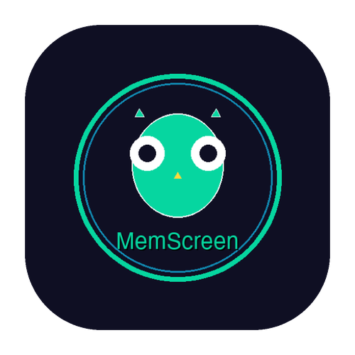
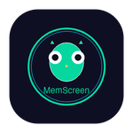

<div align="center">

  <!-- Main Logo -->
  

  # 🦉 MemScreen

  ### **AI-Powered Visual Memory. 100% Private.**

  <br/>

  [](https://www.producthunt.com/products/memscreen)
  [](https://www.shipit.buzz/products/memscreen)
  [](https://www.nxgntools.com/tools/memscreen)
  [](https://github.com/smileformylove/MemScreen)
  [](https://github.com/smileformylove/MemScreen)
  [](https://github.com/smileformylove/MemScreen/stargazers)
  [](LICENSE)
  [](https://www.python.org/downloads/)
  [](https://ollama.com)
  [](https://docs.vllm.ai/)
  [](https://github.com/smileformylove/MemScreen/releases/tag/v0.6.1)

  **100% Local • 100% Private • AI-Powered Visual Memory System**

  [⚡ Quick Start](#-quick-start) • [✨ Features](#-features) • [📖 Documentation](#-documentation)

</div>

---

## ✨ What is MemScreen?

**MemScreen** is your personal AI-powered visual memory system that captures, understands, and remembers everything on your screen — **100% locally, 100% privately**.

### 🚀 The Problem

> Ever forgotten something you saw on your screen?
> - "What was that article about Python decorators I read yesterday?"
> - "Where did I see that UI mockup with the dark blue button?"
> - "What was that function I wrote last Tuesday?"

### 💡 The Solution

**MemScreen** gives you a **photographic memory for your digital life**:

<table align="center">
<tr>
<td align="center" width="20%">

### 📸 Record

</td>
<td align="center" width="20%">

### 🤖 Understand

</td>
<td align="center" width="20%">

### 🔍 Search

</td>
<td align="center" width="20%">

### 💬 Ask

</td>
<td align="center" width="20%">

### 🔒 Private

</td>
</tr>
<tr>
<td align="center">

**Screen Recording**
<br/>
Capture continuously or on-demand

</td>
<td align="center">

**AI-Powered**
<br/>
Local vision models understand your screen

</td>
<td align="center">

**Semantic Search**
<br/>
Find anything by meaning, not keywords

</td>
<td align="center">

**Natural Language**
<br/>
Just ask like you would a person

</td>
<td align="center">

**100% Local**
<br/>
Everything runs on your machine

</td>
</tr>
</table>

<div align="center">

  **🎉 Featured on Product Hunt, ShipIt & NXGenTools!**

  **🎉 v0.6.1 — Flutter Floating Ball Stability Update!**

  ### 🚀 Latest Features (v0.6.1)
  - 🧭 **Two-step region recording** — Select region first, then start recording
  - 📁 **Video list sync** — Auto-refresh after recording stops (immediate + delayed refresh)
  - 🟣 **Floating ball lifecycle fix** — Closing main window no longer kills floating ball
  - 🧹 **Toolbar cleanup** — Force-closes when ball exits, no orphan panels
  - 🚀 **macOS launcher hardening** — Improved process cleanup behavior

  ### 📦 Core Capabilities
  - 🎯 **Flexible Recording** — Full screen, single screen, or custom region
  - 🤖 **Intelligent Agent** — Auto-classification & smart routing (3-5x faster)
  - 📊 **Dynamic Memory** — 15 categories for intelligent organization
  - 🔴 **Native Floating Ball** (macOS) — Real floating window for recording control
  - 💬 **AI Chat Interface** — Natural language queries about your screen history
  - 👁️ **Visual Search** — Find content by meaning, not just keywords

  ### ⚡ Advanced Optimizations
  - 👁️ **Visual Encoder** — SigLIP/CLIP models for accurate visual search
  - 🔍 **Multimodal Search** — Text + Visual hybrid retrieval (30-50% better)
  - 📚 **Tiered Memory** — Working → Short-term → Long-term management
  - 🛡️ **Conflict Resolution** — Smart duplicate detection & merging
  - 🎬 **Multi-granular Vision** — Scene/Object/Text level understanding
  - 💬 **Visual QA Optimization** — Chain-of-thought for 7b models

  [View Full Changelog](https://github.com/smileformylove/MemScreen/compare/v0.6.0...v0.6.1)

</div>

---

## ⚡ Quick Start

Get up and running in **3 minutes** — **no API keys, no cloud, no signup!**

### 🚀 Source Code Installation (Recommended)

**Best for developers and users who want the latest features**

```bash
# 1. Clone repository
git clone https://github.com/smileformylove/MemScreen.git && cd MemScreen

# 2. Create virtual environment
python3 -m venv venv
source venv/bin/activate  # On Windows: venv\Scripts\activate

# 3. Install dependencies
pip install -e .

# 4. Launch 🚀
python setup/start.py
```

✅ **That's it!** MemScreen will start and guide you through the rest.

📚 **Platform-Specific Guides:**
- 🍎 [macOS Installation](docs/guides/INSTALL_MACOS.md)
- 🐧 [Linux Installation](docs/guides/INSTALL_LINUX.md)
- 🪟 [Windows Installation](docs/guides/INSTALL_WINDOWS.md)

---

### 🖥️ Dual Frontends: Kivy (Default) + Flutter (Optional)

MemScreen supports **two frontends**; default is **Kivy UI** (launched with `python setup/start.py`).

- **Kivy** — Default Python-based desktop UI. Run `python setup/start.py` (or `setup/run.sh`). No extra steps.
- **Flutter** — Modern cross-platform UI with HTTP API backend. Use when you prefer a Flutter desktop client.

---

### 📱 Flutter Frontend Quick Start

#### Prerequisites

Before launching Flutter, ensure you have:

1. **Python 3.8+** installed with MemScreen dependencies
2. **Flutter SDK** installed ([Download](https://flutter.dev/docs/get-started/install))
3. **Virtual environment** created (`python3 -m venv venv`)
4. **MemScreen installed** (`pip install -e .`)

#### Option 1: One-Click Launch (Recommended) ⚡

The easiest way to start Flutter frontend with all dependencies:

```bash
# From project root
./scripts/start_flutter.sh
```

**This script automatically:**
- ✅ Activates the virtual environment
- ✅ Starts the API backend (if not running)
- ✅ Installs Flutter dependencies
- ✅ Builds and launches the Flutter app
- ✅ Handles cleanup on exit

**What happens:**
1. Script checks for existing API at `http://127.0.0.1:8765`
2. If not running, starts API backend in background
3. Waits for API to be ready (health check)
4. Builds Flutter app in release mode
5. Launches the app and keeps both processes running
6. On app exit, automatically shuts down API (if started by script)

#### Option 2: Manual Launch

For development or custom configuration:

**Step 1: Start the API Backend**

```bash
# Activate virtual environment
source venv/bin/activate  # or: conda activate MemScreen

# Start API server
python -m memscreen.api
# or: python setup/start_api.py
```

API runs at `http://127.0.0.1:8765` by default.

**Step 2: Launch Flutter App**

```bash
# Navigate to Flutter project
cd frontend/flutter

# Install dependencies (first time only)
flutter pub get

# Run in development mode (hot reload enabled)
flutter run

# Or run on specific platform
flutter run -d macos    # macOS
flutter run -d windows   # Windows
flutter run -d linux     # Linux
```

#### Development vs Release Mode

**Development Mode** (`flutter run`):
- ✅ Hot reload & hot restart
- ✅ Debug logging
- ✅ DevTools integration
- ❌ Slower performance

**Release Mode** (default in `start_flutter.sh`):
- ✅ Optimized performance
- ✅ Smaller binary size
- ✅ Production-ready
- ❌ No hot reload

To build release manually:
```bash
cd frontend/flutter
flutter build macos --release   # macOS
flutter build windows --release  # Windows
flutter build linux --release    # Linux
```

The built app will be in `frontend/flutter/build/<platform>/`.

#### Configuration

**API URL Configuration:**

If your API runs on a different URL, configure it in the Flutter app:

1. Open Flutter app Settings
2. Click on "API URL" field
3. Enter your API URL (e.g., `http://192.168.1.100:8765`)
4. Click "Retry Connection"

Or set via environment variable before starting API:
```bash
export MEMSCREEN_API_PORT=8765
export MEMSCREEN_API_HOST=0.0.0.0  # Listen on all interfaces
python -m memscreen.api
```

#### Flutter App Features

**Core Screens:**
- 🏠 **Home** — Quick access to all features
- 💬 **Chat** — AI chat with streaming responses, model switching, and history
- 📊 **Process** — Track keyboard/mouse usage, session analysis
- 🎥 **Recording** — Full screen, single screen, or region recording
- 📁 **Videos** — Manage and view recorded videos
- ⚙️ **Settings** — Configure API, models, and preferences
- ℹ️ **About** — App information and version

**Key Features:**
- 🔄 **Connection Status** — Real-time API connection indicator with retry
- 📝 **Streaming Responses** — Real-time AI chat responses
- 🖥️ **Screen Target Selection** — Choose a target display in Record > Full Screen
- 🎯 **Region Selection** — Visual region selector for recording
- 🔄 **Auto-Refresh** — Video list updates after recording
- 💾 **Session Management** — Process tracking sessions with manual/auto save

#### Troubleshooting

**API Connection Failed:**
```bash
# Check if API is running
curl http://127.0.0.1:8765/health

# View API logs
tail -f ~/.memscreen/logs/api.log

# Restart API manually
python setup/start_api.py
```

**Flutter Build Errors:**
```bash
# Clean Flutter build cache
cd frontend/flutter
flutter clean

# Re-fetch dependencies
flutter pub get

# Rebuild
flutter run
```

**Multiple App Instances:**
The `start_flutter.sh` script automatically handles cleanup, but if you have issues:
```bash
# Kill existing Flutter apps
pkill -f 'memscreen_flutter.app'

# Kill stale Flutter processes
pkill -f 'flutter_tools.snapshot'
```

**Permission Issues (macOS):**
```bash
# Grant screen recording permission
# System Settings → Privacy & Security → Screen Recording
# Add Terminal or your IDE to the allowed list
```

See [docs/FLUTTER.md](docs/FLUTTER.md) for detailed Flutter documentation, dependencies, and development notes.

---

### 🤖 Automated Installation (Optional)

**For fully automated setup**

```bash
git clone https://github.com/smileformylove/MemScreen.git && cd MemScreen
./setup/install/install.sh  # macOS & Linux
setup\install\install.bat   # Windows
```

✅ **Automatically handles:**
- Python version check
- Virtual environment creation
- Dependency installation
- Ollama setup
- AI model download

---

### 🐋 Docker Installation

**Isolated environment** - No dependencies to install!

```bash
cd setup/docker
docker-compose up --build
```

📚 **See:** [Docker Guide](docs/guides/DOCKER_TEST.md) for advanced options

---

> **💡 Floating Ball Mode (macOS):**
> - On macOS, MemScreen starts with a **floating ball** in top-right corner
> - **Right-click** the ball to open the action toolbar (Recording, Videos, AI Chat, etc.)
> - Full-screen workflow: choose target screen in **Record** page or in floating-ball toolbar **Screen** selector
> - Region workflow: **Select Region** first, then press **Start Recording**
> - Region selection is bound to selected target screen (main UI and floating ball stay in sync)
> - **Left-click** the ball to reopen the main window
> - Closing the main window keeps the floating ball alive; use the toolbar's **Quit** to exit completely
> - **Drag** the ball to any position on screen
> - Video list auto-refreshes after recording stops (includes delayed refresh after async save)

> **💡 Pro Tip:** Once models are downloaded, MemScreen works **completely offline**.

---

## ✨ Features

<div align="center">

  

  **Comprehensive Screen Memory System**

</div>

### 🎯 Screen Recording

- **🖥️ Full Screen & Custom Region** — Record everything or select specific areas
- **📐 Visual Guides** — Crosshair guides for precise region selection
- **⏱️ Flexible Intervals** — Set capture frequency (0.5s - 5s)
- **👁️ Live Preview** — See exactly what's being captured
- **🔴 Native Floating Ball** (macOS) — Real floating window with drag-and-drop control
  - **Cross-Space Visibility** — Stays visible across all desktop spaces
  - **Smart Interaction** — Left-click to show window, right-click for menu
  - **Recording Status** — Visual feedback (purple/red/yellow indicators)
  - **Draggable** — Move anywhere on screen

### 🤖 AI-Powered Understanding

- **🧠 Vision Intelligence** — Local MLLM (qwen2.5vl) understands your screen
- **📝 OCR Text Extraction** — Extract text from any screen content
- **🎨 Scene Recognition** — Identifies applications, activities, and UI elements
- **🔍 Semantic Search** — Find anything by meaning, not just keywords

### 🤖 Intelligent Agent

- **⚡ Auto Classification** — Recognizes 15 input types automatically
- **🎯 Intent Recognition** — Identifies 7 query intents for smart routing
- **🚀 3-5x Faster** — Category-based routing speeds up responses
- **💰 70% Fewer Tokens** — Targeted context retrieval

### 📊 Dynamic Memory System

- **🗂️ 15 Categories** — Intelligent memory organization
- **🔍 Smart Search** — Search only relevant categories
- **🎯 Context Optimization** — Retrieves the most relevant context
- **🌏 Multi-Language** — Chinese and English support

### 🔒 Privacy First

- **✅ 100% Local** — All AI processing on your machine
- **🚫 No Cloud** — No data sent to external servers
- **🔐 No API Keys** — Works out of the box
- **📖 Open Source** — Verify the code yourself

### 🚀 Advanced Optimizations

> **30-50% better visual recall, 40-60% more accurate Q&A!**

- **👁️ Visual Encoder (SigLIP/CLIP)** — Native visual embeddings for accurate image search
- **🔍 Multimodal Search** — Hybrid text+visual retrieval with RRF fusion
- **📚 Tiered Memory** — Working → Short-term → Long-term automatic management
- **🛡️ Conflict Resolution** — Smart duplicate detection and automatic merging
- **🎬 Multi-granular Vision** — Scene/Object/Text level understanding
- **💬 Visual QA Optimization** — Chain-of-thought prompts for 7b models

📖 **See:** [Optimization Guide](docs/IMPLEMENTATION_SUMMARY.md) • [Integration Guide](docs/integration_guide.py)

---

## 🆚 Why MemScreen?

| Feature | MemScreen | OBS | Loom | CleanShot X |
|---------|-----------|-----|------|-------------|
| **Privacy** | ✅ **100% Local** | ✅ Local | ❌ Cloud | ✅ Local |
| **AI Understanding** | ✅ **Local MLLM** | ❌ No | ✅ Cloud AI | ❌ OCR only |
| **Semantic Search** | ✅ **Yes** | ❌ No | ❌ No | ❌ No |
| **Natural Language** | ✅ **Yes** | ❌ No | ❌ No | ❌ No |
| **Custom Region** | ✅ **Yes** | ✅ Yes | ❌ No | ✅ Yes |
| **Process Mining** | ✅ **Yes** | ❌ No | ❌ No | ❌ No |
| **Open Source** | ✅ **MIT** | ✅ GPL | ❌ No | ❌ No |
| **Cost** | **Free Forever** | Free | $15-30/mo | Paid |

---

## 🧠 AI Inference Backends

MemScreen supports **multiple local AI inference backends**:

| Backend | Setup | Hardware | Best For |
|---------|-------|----------|----------|
| **🦙 Ollama** | ⭐ Easy | CPU/GPU | Development, Mac users |
| **⚡ vLLM** | ⭐⭐ Medium | GPU (12GB+) | Production, throughput |
| **🚀 Step-3.5-Flash** | ⭐⭐⭐ Hard | 4x GPU (200GB+) | Complex reasoning |

### Quick Switch

```bash
# Use Ollama (default)
export MEMSCREEN_LLM_BACKEND=ollama

# Use vLLM
export MEMSCREEN_LLM_BACKEND=vllm
export MEMSCREEN_VLLM_URL=http://localhost:8000

# Use Step-3.5-Flash
export MEMSCREEN_LLM_BACKEND=vllm
export MEMSCREEN_VLLM_URL=http://localhost:8001
export MEMSCREEN_VLLM_LLM_MODEL=stepfun-ai/Step-3.5-Flash
```

📚 **See:** [vLLM Backend Guide](docs/VLLM_BACKEND.md) • [Step-3.5-Flash Guide](docs/STEP35FLASH.md)

---

## 📖 Documentation

**🚀 Getting Started:**
- [Installation Guide](docs/INSTALLATION.md) — Detailed setup instructions for all platforms
- [Docker Deployment](docs/DOCKER.md) — Containerized deployment guide
- [macOS Build Guide](docs/MACOS_BUILD_GUIDE.md) — Build for macOS
- [Ubuntu Installation Guide](docs/UBUNTU_INSTALLATION_GUIDE.md) — Linux setup
- [macOS Permission Guide](docs/MACOS_PERMISSION_GUIDE.md) — macOS permissions explained

**💡 User Guides:**
- [Accessibility Guide](docs/guides/ACCESSIBILITY.md) — Accessibility features setup
- [Process Mining Guide](docs/guides/PROCESS_MINING.md) — Track keyboard and mouse usage
- [Docker Test Guide](docs/guides/DOCKER_TEST.md) — Test Docker deployment
- [Recording Guide](docs/RECORDING_GUIDE.md) — Screen recording features
- [Audio Recording Guide](docs/AUDIO_RECORDING.md) — Audio capture setup
- [Floating Ball Guide](docs/FLOATING_BALL.md) — Native floating ball usage (macOS)

**🤖 AI Backend Configuration:**
- [vLLM Backend](docs/VLLM_BACKEND.md) — High-performance inference backend
- [vLLM Implementation Summary](docs/history/VLLM_IMPLEMENTATION_SUMMARY.md) — Implementation details

**🏗️ System Architecture:**
- [Architecture Overview](docs/ARCHITECTURE.md) — System design and components
- [Project Structure](docs/PROJECT_STRUCTURE.md) — Code organization
- [Intelligent Agent System](docs/INTELLIGENT_AGENT.md) — Auto-classification and smart dispatch
- [Dynamic Memory System](docs/DYNAMIC_MEMORY.md) — Categorized memory and search
- [Core API Documentation](docs/CORE_API.md) — API reference
- [Flutter Frontend Guide](docs/FLUTTER.md) — Flutter UI documentation

**🔧 Development:**
- [Testing Guide](docs/TESTING_GUIDE.md) — How to test the system
- [Packaging Guide](docs/PACKAGING.md) — Package for distribution
- [Logo & Brand Guidelines](docs/LOGO_GUIDELINES.md) — Logo usage and branding

---

## 🛠️ Tech Stack

| Component | Technology |
|-----------|------------|
| **Backend** | Python 3.8+ |
| **API Framework** | FastAPI |
| **GUI Framework** | Kivy (default), Flutter (optional) |
| **Screen Capture** | PIL ImageGrab, MSS |
| **Video Processing** | OpenCV, MoviePy |
| **OCR** | EasyOCR |
| **Databases** | SQLite + ChromaDB |
| **AI Backends** | Ollama / vLLM |
| **Vision Models** | qwen2.5vl:3b / Qwen2-VL |
| **Advanced Reasoning** | Step-3.5-Flash (optional) |

---

## 📝 What's New

### ✨ v0.6.1 — Flutter Floating Ball Stability Update (February 2026)

- 🧭 **Two-step region recording** — Select region first, start recording on explicit button click
- 📁 **Video list sync** — New recordings now auto-refresh in `Videos` after stop (immediate + delayed refresh)
- 🟣 **Floating ball lifecycle fix** — Closing main window no longer kills floating ball
- 🧹 **Toolbar cleanup fix** — Floating toolbar is force-closed when ball exits, no orphan panel left on screen
- 🚀 **macOS launcher hardening** — Startup script runs built app binary and improves process cleanup behavior

### ✨ v0.6.0 — Floating Ball Mode & UI Polish (February 2026)

- 🔴 **Floating Ball First** — macOS starts with floating ball, main window stays minimized
- 🎨 **Branded Experience** — Floating ball displays your logo with circular masking
- 🖱️ **Simplified Control** — All features accessible via right-click menu
- 📱 **Cleaner Interface** — Drag anywhere, left-click to toggle window, right-click for menu
- 🎯 **Region Selection** — Native macOS region selector with visual feedback
- 🧹 **Project Cleanup** — Reorganized structure: docs/, config/, setup/, tests/
- 📚 **Better Documentation** — Centralized docs, updated README, cleanup guides
- 🐛 **Bug Fixes** — Fixed duplicate floating ball, improved state management, coordinate issues

---

## 🗺️ Roadmap

**🎯 Upcoming Features**

- ⌨️ **Global Hotkey Binding** — System-wide shortcuts for quick access
- 🖥️ **CLI Tool** — Command-line interface for power users
- 👁️ **Visual Memory Optimization** — Advanced visual encoding & retrieval improvements
- 🔌 **Plugin System** — Extensible architecture for custom integrations
- 🌐 **Multi-device Sync** — Sync across multiple machines
- 📱 **Mobile Apps** — iOS and Android companions

---

**💡 Have a suggestion?** Join the discussion at [GitHub Discussions](https://github.com/smileformylove/MemScreen/discussions)!

---

## ⭐ Star History

[](https://star-history.com/#smileformylove/MemScreen&Date)

---

## 📁 Project Structure

```
MemScreen/
├── LICENSE                  # MIT License
├── README.md                # This file
├── pyproject.toml           # Python configuration
│
├── memscreen/              # Main application package
│   ├── api/               # FastAPI HTTP server (for Flutter)
│   ├── ui/                # UI components (Kivy)
│   ├── presenters/        # Business logic (MVP)
│   ├── memory/            # Memory system
│   ├── llm/               # LLM integration
│   ├── agent/             # Intelligent agent
│   ├── audio/             # Audio recording
│   └── ...
│
├── frontend/
│   └── flutter/           # Optional Flutter UI (see docs/FLUTTER.md)
│
├── config/                 # Configuration files
│   └── config_example.yaml
│
├── docs/                   # Documentation
│   ├── guides/            # User guides
│   ├── history/           # Development history
│   ├── cleanup/           # Maintenance docs
│   └── ...
│
├── setup/                  # Installation & build
│   ├── install/           # Installation scripts
│   ├── docker/            # Docker files
│   ├── tools/             # Build tools
│   ├── start.py           # Application entry point
│   ├── start_api.py       # API-only entry (for Flutter)
│   ├── run.sh/run.bat     # Run scripts
│   └── MANIFEST.in
│
├── scripts/                # Helper scripts
│   └── start_flutter.sh   # Flutter launcher
│
├── tests/                  # Test suite
├── examples/               # Demo scripts
└── assets/                 # Application assets
```

**User data** is stored in `~/.memscreen/`:
- Databases: `~/.memscreen/db/`
- Videos: `~/.memscreen/videos/`
- Logs: `~/.memscreen/logs/`

📖 **See [docs/PROJECT_STRUCTURE.md](docs/PROJECT_STRUCTURE.md) for detailed documentation.**

---

## 🤝 Contributing

Contributions welcome! Here's how to help:

- 🐛 Report bugs via [Issues](https://github.com/smileformylove/MemScreen/issues)
- 💡 Suggest features via [Discussions](https://github.com/smileformylove/MemScreen/discussions)
- 📝 Improve documentation
- 🔧 Submit pull requests

---

## 📜 License

This project is released under the **MIT License** — free to use, modify, and distribute!

<div align="center">

  

  **⭐ Star us on GitHub — it helps the project grow!**

  [](https://github.com/smileformylove/MemScreen/stargazers)

  **Featured on [Product Hunt](https://www.producthunt.com/products/memscreen), [ShipIt](https://www.shipit.buzz/products/memscreen) & [NXGenTools](https://www.nxgntools.com/tools/memscreen)**

  Made with ❤️ and 🦉 by [Jixiang Luo](https://github.com/smileformylove)

  **v0.6.1** — Flutter Floating Ball Stability Update (February 2026)

  [📧 Email](mailto:jixiangluo85@gmail.com) • [🐛 Report Bug](https://github.com/smileformylove/MemScreen/issues) • [💬 Discussion](https://github.com/smileformylove/MemScreen/discussions)

  ---

  **[🔝 Back to Top](#-memscreen)**

</div>
