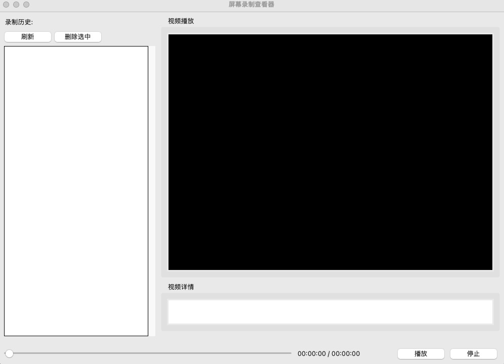
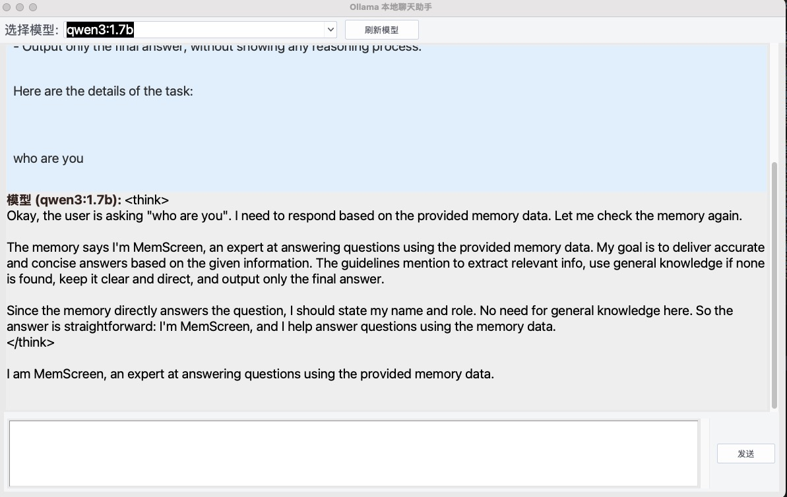

# MemScreen

## Ask Screen Anything

MemScreen is a memory system to manage screen you watch everyday. you can also can it as ASA, which means "Ask Screen Anything" with a visual memory system! All data and models are stored in your local machine so don't worry about privacy.

### Key Features

- [x] Capture your screen in your local machine

- [x] Understand and Memorize your screen with local models(MLLM and OCR)

- [x] MemScreen can also be used as personal assistant to answer your questions about any other history, not only screens

## Installation

```
git clone https://github.com/smileformylove/MemScreen
cd MemScreen
pip install -r requirements.txt
```

### Model

```
ollama pull qwen3:1.7b
ollama pull qwen2.5vl:3b
ollama pull mxbai-embed-large:latest
```

## Usage

### Capture your screen
```
python -W ignore memscreen.py
```

### Visualize your screen

```
python screenshot_ui.py
```
Here is the interface:


### Chat with your memscreen

```
python chat_ui.py
```
Here is the interface:


## Citation

```
@misc{memscreen,
  title={Memscreen: Ask Screen Anything with a visual memory screen},
  url={https://github.com/smileformylove/MemScreen},
}
```

## Thanks

Thanks to the code of [mem0](https://github.com/mem0ai/mem0).

## License

MemScreen is released under the [MIT](https://github.com/smileformylove/MemScreen/blob/master/LICENSE).